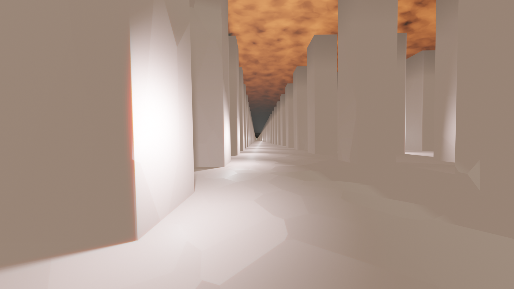

# The VFX
of Colin Phillips

## VFX Over the Years

### My First Ever Shot (2017)
<video controls loop=true>
  <source src="media/laser.mp4">
</video>

### Old Scraps (2017)
<video controls loop=true>
  <source src="media/red_fire.mp4">
</video>
<video controls loop=true>
  <source src="media/forest_cube.mp4">
</video>

### Compositing: Rotoscoping (2017)
<video controls loop=true>
  <source src="media/cabinet.mp4">
</video>

### Compositing: Masking (2018)
<video controls loop=true>
  <source src="media/tree_portal.mp4">
</video>

### Old Magic, Proof of Concept (20XX)

  

    <video controls loop=true>
      <source src="media/magic_circle.mp4">
    </video>
  

  

    <video controls loop=true>
      <source src="media/magic_circle_wall.mp4">
    </video>
  

  

    <video controls loop=true>
      <source src="media/amdusias.mp4">
    </video>
  

### Green Screen & CGI (2020)
<video controls loop=true>
  <source src="media/carbon_earth.mp4">
</video>

### 3D Tracking & Compositing (2022)
<video controls loop=true>
  <source src="media/tv_compare.mp4">
</video>

### Green Screen Proof of Concept (2023)
<video controls loop=true>
  <source src="media/jerma.mp4">
</video>

### CGI Character Proof of Concept (2023)
<video controls loop=true>
  <source src="media/ghosts.mp4">
</video>

### Set Extension Proof of Concept (2024)
<video controls loop=true>
  <source src="media/add_bricks.mp4">
</video>

### Set Extension Proof of Concept, Unlit (2024)
<video controls loop=true>
  <source src="media/buildings.mp4">
</video>

# Assorted CGI

## Clouds

  

    
  

  

    
  

  

    
  

## Volumetrics Demos

<video controls loop=true>
  <source src="media/nebula.mp4">
</video>

<video controls loop=true>
  <source src="media/retro_nebula.mp4">
</video>

### DISCLAIMER
Some of those were old projects, I am always improving and could do them better now.
Also, I am not limited to the stuff shown, these are just examples.

This presentation was thrown together quickly with what I had around.

### Bonus
I have the firm belief that creativity should be as free as it possibly can, so everything I do, I try to do in free and open source software.
Aside from paying for the physical computer, there is no money barrier between what I can do, and what anyone can do.

### Fin
This presentation was originally created as a pitch to my local film club.
It is not a bad portfolio though, so I am keeping it on my website.
