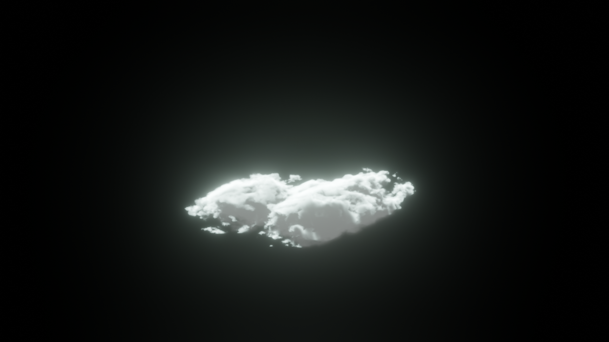
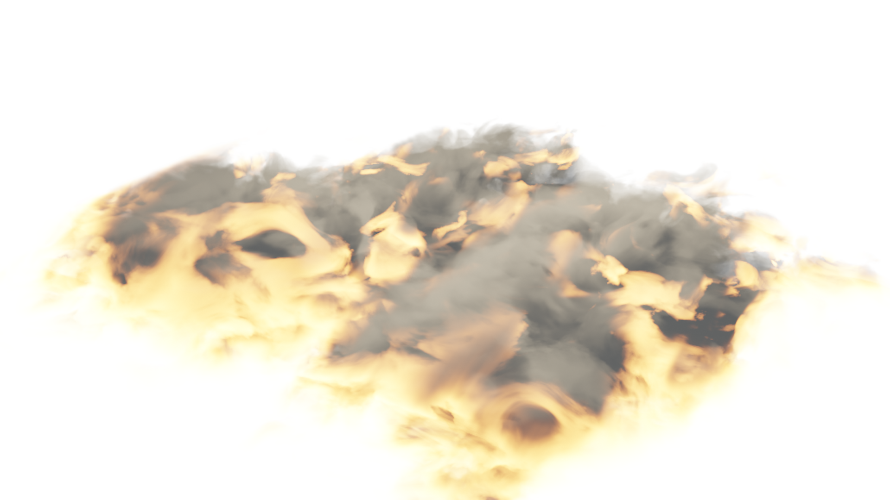

# VFX Experience
of Colin Phillips

## VFX Over the Years

### 3D Tracking & Compositing (2022)
<video controls loop=true>
  <source src="media/tv_compare.mp4">
</video>

### Green Screen & CGI (2020)
<video controls loop=true>
  <source src="media/carbon_earth.mp4">
</video>

### Compositing: Masking (2018)
<video controls loop=true>
  <source src="media/tree_portal.mp4">
</video>

### Compositing: Rotoscoping (2017)
<video controls loop=true>
  <source src="media/cabinet.mp4">
</video>

### Old Scraps (2017)

  

    <video controls loop=true>
      <source src="media/wall_cube.mp4">
    </video>
  

  

    <video controls loop=true>
      <source src="media/forest_cube.mp4">
    </video>
  

  

    <video controls loop=true>
      <source src="media/red_fire.mp4">
    </video>
  

  

    <video controls loop=true>
      <source src="media/saber_fixed_aspect.mp4">
    </video>
  

### My First Ever Shot (2017)
<video controls loop=true>
  <source src="media/laser.mp4">
</video>

# Assorted CGI

## Clouds

  

    
  

  

    
  

  

    
  

## Nebulae (Space Clouds)

<video controls loop=true>
  <source src="media/nebula.mp4">
</video>

<video controls loop=true>
  <source src="media/retro_nebula.mp4">
</video>

## Magic Sigils 

  

    <video controls loop=true>
      <source src="media/magic_circle.mp4">
    </video>
  

  

    <video controls loop=true>
      <source src="media/magic_circle_wall.mp4">
    </video>
  

  

    <video controls loop=true>
      <source src="media/amdusias.mp4">
    </video>
  

## Whatever This Is
<video controls loop=true>
  <source src="media/fire_eye.mp4">
</video>

### DISCLAIMER
Some of those were old projects, I am always improving and could do them better now.
Also I am not limited to the stuff show, these are just examples.

I made this in a day or two and it just has a lot of random stuff I could find quickly across my drives.

### In Closing
- Ask me if a VFX shot is even possible
- Ask me how to approach a VFX shot
- Ask me about me working on your VFX shot

I know a lot of a whole lot of tricks, many more than shown here.
And if I don't know, there is a good chance I can figure it out.

### Bonus
I have the firm belief that creativity should be as free as it possibly can, so everything I do, I do in free and open source software.
Aside from paying for the physical computer, there is no money barrier between what I can do, and what anyone can do.

